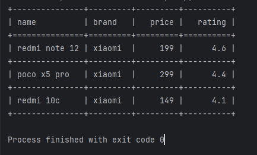
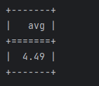
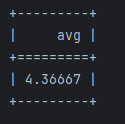

# csv_parser_test
Тестовое задание для Workmate: csv парсер с функциями фильтрации и аггрегации


## Подготовка к использованию
1) Установить зависимости из корневой директории
```bazaar
pip install -r requirements.txt
```

2) Перейти в директорию с парсером
```bazaar
cd .\parser\
```

## Использование

Общий вид команды запуска скрипта:
```bazaar
python main.py -w field(operand)value -a field=aggr_func input_file_name.csv
```

**Доступные операторы для -w: <, >, =**

**Доступные функции аггрегации: min, max, avg**

**Путь к файлу начинается из директории csv_parser_test**

## Примеры использования:

1) -w
```bazaar
python main.py -w brand=xiaomi products.csv
```
Результат:


2) -a
```bazaar
python main.py -a rating=avg products.csv
```
Результат:


3) -w + -a
```bazaar
python main.py
```
Результат:


## Дополнительная информация

* Покрытие тестами: 83%
* Линтер: black
* Автор: Бушланов Глеб Сергеевич